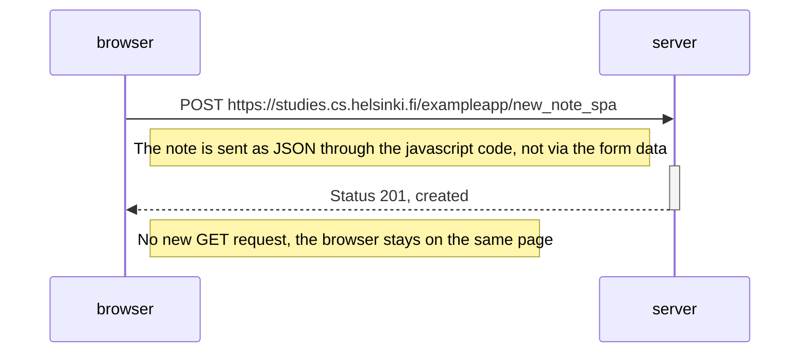

```mermaid
sequenceDiagram
    participant browser
    participant server
        
    browser->>server: POST https://studies.cs.helsinki.fi/exampleapp/new_note_spa
    Note right of browser: The note is sent as JSON through the javascript code, not via the form data

    activate server
    server -->>browser: Status 201, created
    deactivate server

    Note right of browser: No new GET request, the browser stays on the same page
```
